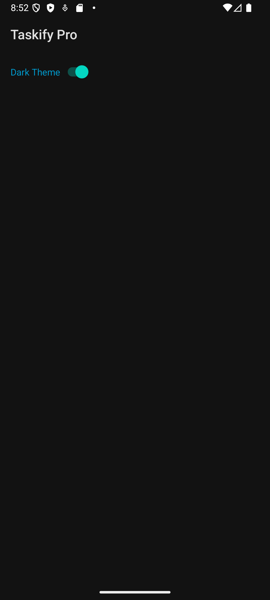

# Taskify Pro

## Overview
**Taskify Pro** is a task management Android app that allows users to create, update, complete, and delete tasks. It also supports light and dark themes using SharedPreferences.

---

## Part 1: Data Storage

### 5.1 SQLite
- Used `TaskDatabaseHelper` to manage a local `tasks` table.
- Fields: `id`, `title`, `description`, `isCompleted`.
- Core operations: `insertTask`, `updateTask`, `deleteTask`, `getAllTasks`.
- Robust error handling when performing database operations.

### 5.2 SharedPreferences
- Theme preference stored via SharedPreferences.
- Users can toggle between light and dark themes in `SettingsActivity`.
- The selected theme is applied every time the app is launched.

---

## Part 2: RecyclerView and Custom Adapters

### 6.1 Dynamic Lists
- `RecyclerView` displays all tasks in real time.
- When a task is added, updated, or deleted, the list updates automatically.

### 6.2 Custom Adapter
- Custom `TaskAdapter` displays:
  - Task title
  - Description
  - Completion checkbox
  - Delete button
- Efficient ViewHolder pattern and click listeners.

---

## 📸 Screenshots

<table>
  <tr>
    <td align="center">
       
      <b>Task List</b>
    </td>
    <td align="center">
       
      <b>Task Added View</b>
    </td>
  </tr>
  <tr>
    <td align="center">
       
      <b>Settings - Light Theme</b>
    </td>
    <td align="center">
       
      <b>Settings - Dark Theme</b>
    </td>
  </tr>
</table>

---

## How to Run

1. Clone or download the repository from GitHub.
2. Open the project in Android Studio.
3. Run it on an emulator or physical Android device.
4. Use the main screen to manage tasks.
5. Access Settings to toggle between light and dark modes.

---

## 📂 GitHub Repository

🔗 **GitHub Link**: [https://github.com/dhruvjivani/taskify-pro](https://github.com/dhruvjivani/taskify-pro)

---

## Credits

Developed by Dhruv Jivani  
Course: INFO1730 – Web Application Design  
Instructor: Jainesh Desai
